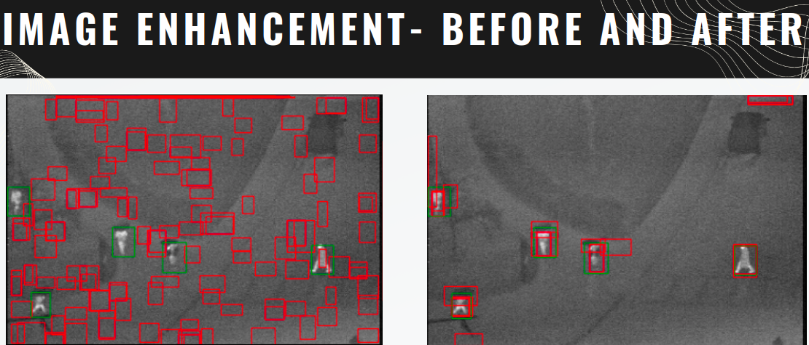

# Flood-survivors detection using IR imagery on an autonomous drone
## Introduction
The project includes implementing an image
classification system to detect flood survivors using
infrared images captured from UAVs in real-time.
- The images used are captured using LWIR ( Long Wave
Infrared ) cameras and are of low resolution.
- This particular problem is especially challenging due to the limited computational power available on-board commercial drone platforms and the requirement of real-time detection and localization. 
- We follow an approach proposed in the Project Report “Flood-survivors detection using IR imagery on an autonomous drone” by Sumant Sharma , with some modifications.

## The Approach in three steps
- We First extract the Maximally Stable Extremal Regions (MSERs) from the images to detect IR hotspots.

- Extract Features from the Detected Hotspots based on Integral Channel Feature Descriptors for the Classifiers
  

- Classify the extracted features using classifiers like SVM, Naive Bayes, etc. to detect survivors.
  

## MSER Detection
- The MSER algorithm essentially extracts stable connected components of some gray-level sets of the image by taking regions which stay nearly the same throughout a wide range of thresholds.
- The underlying assumption is that the temperatures of the bodies of humans will be greater than the temperature of the surroundings. Can lead to false positives.
- The MSER algorithm is implemented using the OpenCV library.

## Image Enhancement
- In order to extract good MSER regions, we first apply a series of Image processing techniques to enhance the image.
- We first apply a sharpening filter on the grayscale image by convolving it with a kernel. This enhances the edges and details.
- We then perform a Morphological opening on the image, the result is then subtracted from the image, thus enhancing the details and reducing the background.
- Histogram equalization is then applied to improve the overall contrast of the image.
- A deconvolution operation is performed using a specified point spread function (PSF). This process aims to reverse the blurring effects in the image.

## Feature Extraction
- We use the Integral Channel Feature (ICF) descriptor to extract features from the detected MSER regions.
- The ICF descriptor is a fast and efficient feature descriptor which is used in the Viola-Jones face detection algorithm.
- The ICF descriptor is a 2D extension of the Haar-like features used in the Viola-Jones algorithm.
- The ICF descriptor is computed using integral images. The integral image is a 2D matrix where each element is the sum of all the pixels above and to the left of the original image pixel.

## Results

## Observations
- From the Confusion Matrices, we observe that the Naive Bayes Classifier performs the best, with a True Positive (TP) rate of 92.2% and a False Positive rate of 13.6%. Followed by the SVM with RBF Kernel, with a TP rate of 81.0% and a lower False Positive rate of 9.3%. The worst performing Classifier is the Linear SVM, with a TP rate of 62.7% and a False positive rate of 10.8%.
- From the ROC curves, we see that the SVMs overfit on the data very quickly, as opposed to the naive bayes classifier.
- We see that In terms of False Negatives, ie. in the event the classifier misses a survivor in the picture, Naive Bayes has the least False Negative of the three, followed by the SVM (RBF) and then SVM (Linear)

## Conclusion
- Although the SVMs took longer to train, they underperform compared to the computationally efficient Naive Bayes classifier. This might be due to the underlying geometry of the features that have been extracted.
- Naive Bayes does not make strong underlying assumptions about the boundary of the person, whereas linear SVMS may underperform if the decision boundary is not well approximated with a linear function.
- This reasoning makes sound sense with the fact that SVM with RBF Kernel performed better than Linear SVMs.
- We Conclude that from our Experimentation, the Naive Bayes Classifier is the best classifier of the three we have tested, owing to its High True Positive Rate, and Low False Negative Rate, which is crucial in a human-survival scenario where we need to detect all possible humans.
